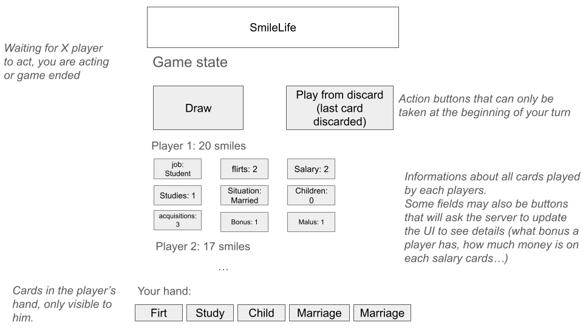
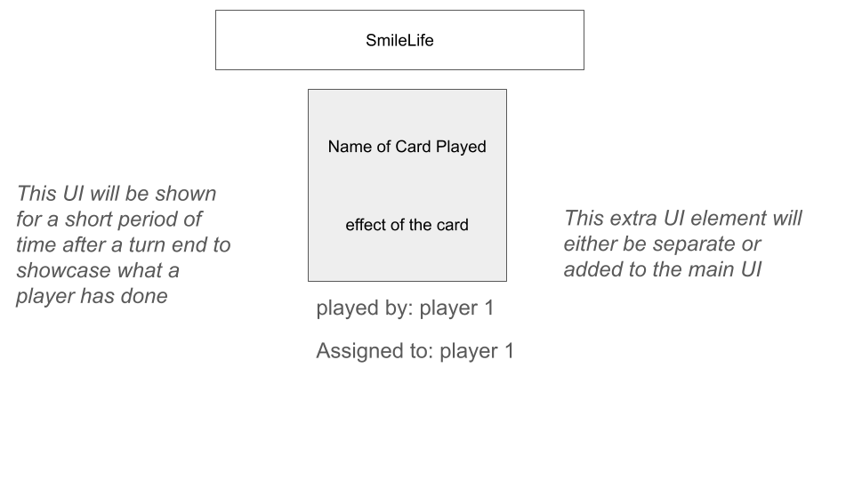

# ul2025app68 : Smile Life

Smile Life is a multiplayer card game inspired by the board game Smile Life, where players build their life by playing cards representing studies, jobs, family, money, bonuses, and maluses. The goal is to accumulate the most Smiles (points) by the end of the game.

The game is implemented as a client–server web application using a finite state machine to enforce rules and synchronize all players

## Proposal

### User stories

As a player, when I am in a game room, I want to see the state of the game and the cards that I and the other players have played, so that I can understand the situation of the match.

As a player, when it is my turn, I want to be able to either draw and play a card, or play a card from the discard pile, in order to make the game progress.

As a player, when I play a card, I want to know what this card does and whether I am allowed to play it according to the rules of the game.

As a player, when reaching the end of the game, I want to know who won by seeing the cards of each player and the amount of points they have.

### Requirements

The game must allow multiple players to join and interact with the same evolving game state. Cards in a player's hand must be visible only to that specific player. The app must show all cards that have been played to all players, as well as the number of points each of them has. The game must inform all players whose turn it is and when the game is over.

Gameplay will be controlled by a finite state machine enforcing the rules and managing the players’ actions. This includes action requirements (whether a player is allowed to place a specific card), smile counting, turn order, and game-state transitions. The projection of the game state to the UI will also be handled remotely by the server.

Each card type must apply its respective effects, which can be separated into three groups, and these effects must be handled by the server:
- Cards with points (smiles) must only be placed in front of the player who plays them, if allowed (some cards require prerequisites). When placed, they must update the UI, the game state, and the point counter if necessary.
- Malus cards do not grant points and can only be placed on other players if allowed. When placed, they must update the UI, the game state, and the point counter if necessary.
- Bonus cards may or may not grant points. They are always placed in front of the player who plays them and must update the UI, the game state, and the point counter if necessary.

### How to Run the Game

Prerequisites:
- Java JDK 17 (or compatible)
- sbt (Scala Build Tool)
- A modern web browser (Chrome / Firefox)

Running the server locally:
From the root of the project: sbt
Then, inside the sbt shell: run
This starts the web server.

Accessing the game:
Once the server is running, open your browser and go to:
http://localhost:8080
Each browser tab represents a different player.
You can open multiple tabs (or different browsers) to simulate multiple players in the same game.

### Gameplay Overview

Turn Structure
- The current player must draw one card (from draw pile or discard pile).
- The player then plays or discards exactly one card.
- The turn ends and passes to the next player.
- If the next player has a skip-turn malus, their turn is skipped and the malus is destroyed.

End of Game
- The game ends when the draw pile is empty.
- Scores are computed based on Smiles.
- The player(s) with the highest score win.
- Multiple winners are possible in case of a tie.

### Rules Summary (Player Guide)

Goal of the Game:
The goal is to collect the maximum number of Smiles (points) by building your life with cards such as studies, jobs, family, money, bonuses, and by avoiding maluses.
The player(s) with the highest number of Smiles at the end of the game win.

Turn Rules:
On your turn, you must follow exactly this order:
- Draw one card:
    - From the draw pile, or
    - From the discard pile (top card only)
- Play one card or discard one card:
    You must end your turn with the same number of cards you started with.

You cannot:
- Play before drawing
- Draw twice
- Skip playing or discarding

Card Placement Rules:
- Studies & Profession
    - You need to play Study cards before being able to play a Profession.
    - Only one Profession is allowed at a time.
    - You cannot study while you have a profession
- Money
    - Money can only be used if you have a Profession.
    - Money is consumed when paying for cards like Travel or House.
- Family & Lifestyle Cards
    - Cards such as Flirt, Marriage, Child, Pet, House, Travel give Smiles.
    - Some require prerequisites (Marriage before Child, money before House, etc.).

Malus Cards:
- Malus cards are usually played on other players.
- Examples: Disease, Accident, BurnOut, Tax, Dismissal.

Skip-turn maluses:
- Disease, Accident, BurnOut cause the target player to lose their next turn.
- After skipping the turn, the malus is destroyed (not discarded).

Other maluses:
- Some maluses remove cards (money, studies, job, children, etc.).
- If the target does not have a valid card to remove, the move is illegal.

Quit Job:
- You can quit your job only if you have a Profession.
- Quitting a job removes the Profession from your board.
- The removed Profession is destroyed (not put in the discard pile).
- Quitting your job ends your turn.

End of the Game:
- The game ends when the draw pile is empty.
- Final Smiles are counted.
- Malus cards played by other players reduce your score.
- The player(s) with the highest Smile count win.

### User Interface

Main Game View

The UI displays:
- Game title and current state
- Turn indicator (whose turn it is)
- Game log (who played what card)
- Action buttons (Draw from pile or discard pile, play or discard card, quit job, end the game, target of your malus)
- Boards of all players, showing:
    - Smile count for each player
    - Profession
    - Studies
    - Flirts
    - Children
    - Money
    - Bonuses
    - Maluses
    - Travels
    - Houses
- Your hand, visible only to you

Card Action Feedback

After a card is played, a short-lived UI element can display:
- Name of the card
- Effect of the card
- Player who played it
- Target player (if applicable)
This helps all players understand what just happened.

### Mock-ups

### Architecture

Server

- Logic.scala Implements:
    - Game rules
    - Turn management
    - Card effects
    - Skip-turn handling
    - End-of-game logic

- Wire.scala Handles communication between server and clients.

Client

- HTML UI and Text UI
- Stateless: only renders projected server state
- Sends user actions as events to the server

### Roles

Matthias will handle the UI, Guillaume will manage the Wire component, and Corentin and Guillaume will collaborate on the Logic portion, distributing tasks evenly to ensure equal contribution from all team members

### Status

The game currently supports:
- Full multiplayer gameplay
- Turn skipping with malus destruction
- Card prerequisites and payments
- Score computation and victory detection
- HTML and Text user interfaces
